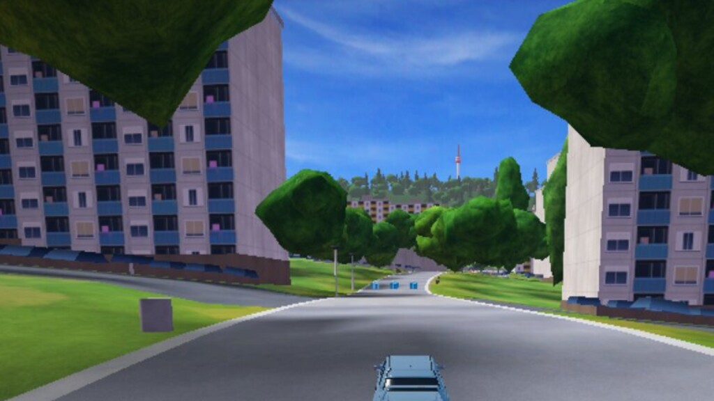

# Gazdagrét - Kaptató sétány

A [SuperTuxKart](https://supertuxkart.net) add-on track along Kaptató sétány, the promenade through the Gazdagrét housing estate in Budapest. The lap runs down the walkway between the panel blocks and comes back on Rétköz utca, past the local shops, schools and the 8E bus.



## Install

Clone it into your SuperTuxKart add-on tracks folder:

```bash
cd ~/.local/share/supertuxkart/addons/tracks
git clone https://github.com/AronNovak/stk-track-gazdagret.git
```

The tracks folder is `%APPDATA%\supertuxkart\addons\tracks` on Windows and `~/Library/Application Support/SuperTuxKart/addons/tracks` on macOS. Without git, download the ZIP and extract it there.

The track shows up under the Add-Ons group. Tested with SuperTuxKart 1.5.

## License

Copyright © 2026 Áron Novák. Licensed under [CC BY-SA 4.0](license.txt).

The music and sky box come from the SuperTuxKart base game and are not part of this repository. Shop and street signs only show the names of real places and are not endorsed by their owners.
